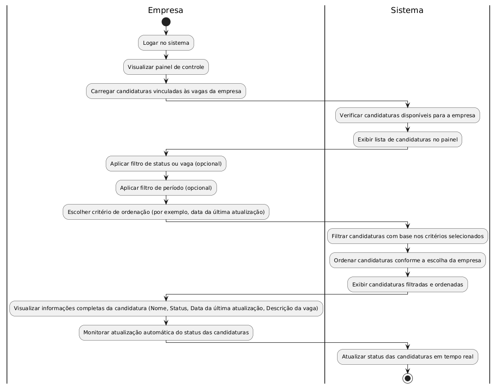

# Visualização de Status de Candidaturas no Painel de Controle

## Descrição

**COMO** empresa  
**QUERO** visualizar o status de todas as candidaturas recebidas no painel de controle  
**PARA** que eu possa acompanhar e gerenciar de forma centralizada o progresso dos processos seletivos.

---

## Prioridade  
### Alta  
Essencial para que as empresas acompanhem os processos seletivos e tomem decisões informadas.  

---
## Dados e Validações

### Dados Necessários

1. **ID da Vaga**  
   - **Tipo:** Inteiro  
   - **Validação:** Deve existir no sistema e estar associada à empresa.  

2. **ID da Candidatura**  
   - **Tipo:** Inteiro  
   - **Validação:** Deve existir no sistema e estar vinculada a uma vaga da empresa.  

3. **Nome do Candidato**  
   - **Tipo:** String  
   - **Validação:** Deve ser exibido conforme cadastrado no sistema.  

4. **Status da Candidatura**  
   - **Tipo:** Enum (Ex.: "Inscrição Realizada", "Em Análise", "Entrevista Agendada", "Aprovado", "Reprovado")  
   - **Validação:** Deve refletir o status atualizado no sistema.  

5. **Data da Última Atualização**  
   - **Tipo:** Data e Hora  
   - **Validação:** Deve ser uma data válida e sempre posterior ou igual à data da criação da candidatura.  

6. **Descrição da Vaga**  
   - **Tipo:** String  
   - **Validação:** Deve ser exibida conforme cadastrada no sistema.  

---

## Validações Adicionais

- Apenas candidaturas vinculadas a vagas criadas pela empresa logada devem ser exibidas no painel de controle.  
- O status de cada candidatura deve ser atualizado em tempo real no painel, garantindo que as informações estejam sempre atualizadas.  
- O sistema deve ordenar as candidaturas por padrão pela **data de última atualização**, podendo ser alterado por critérios definidos pelo usuário (ex.: ordem alfabética do candidato, status, etc.).  
- O painel deve permitir filtros como:  
  - Status da candidatura (ex.: mostrar apenas "Em Análise" ou "Aprovados").  
  - Vaga específica.  
  - Período de tempo (ex.: candidaturas recebidas nos últimos 30 dias).  

---

## Critérios de Aceitação

1. **Exibição de candidaturas:**  
   - Todas as candidaturas vinculadas às vagas da empresa devem ser exibidas no painel de controle.  

2. **Filtro funcional:**  
   - O sistema deve permitir aplicar filtros para refinar a exibição das candidaturas (ex.: por status, vagas ou período).  

3. **Informações completas e precisas:**  
   - Cada candidatura deve apresentar as seguintes informações:  
     - Nome do candidato.  
     - Status da candidatura.  
     - Data da última atualização.  
     - Descrição da vaga.  

4. **Atualização em tempo real:**  
   - Sempre que o status de uma candidatura for alterado, a informação deve ser atualizada automaticamente no painel da empresa.  

5. **Ordenação padrão:**  
   - As candidaturas devem ser ordenadas por padrão pela **data da última atualização**, com opção de ordenação personalizada.  

6. **Interface clara:**  
   - O painel de controle deve ser visualmente organizado e facilitar a navegação por parte do usuário.  

---

## Como Utilizar

1. A empresa acessa o painel de controle no sistema.  
2. No painel, são exibidas todas as candidaturas vinculadas às vagas da empresa, com as informações de status atualizadas.  
3. O usuário pode aplicar filtros para visualizar apenas candidaturas específicas (ex.: por status, vaga ou período de tempo).  
4. O sistema permite alternar entre diferentes critérios de ordenação para facilitar a análise das candidaturas.  
5. O painel é atualizado automaticamente sempre que houver mudanças nas candidaturas vinculadas à empresa.  

---

