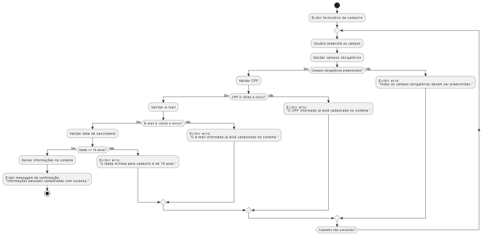

# Cadastro de Informações Pessoais

## Descrição

**COMO** usuário do sistema  
**QUERO** cadastrar minhas informações pessoais  
**PARA** que eu possa acessar e gerenciar meu estágio.  

---

## Prioridade

### Alta
Cadastro de informações pessoais é essencial para o funcionamento básico do sistema e para personalização da experiência do usuário.

---

## Dados e Validações

### Dados Necessários

1. **Nome Completo**
   - **Tipo:** String  
   - **Validação:** Não vazio, deve conter apenas letras e espaços, com mínimo de 3 caracteres.

2. **CPF**
   - **Tipo:** String  
   - **Validação:** Deve ser um CPF válido e único no sistema.

3. **Data de Nascimento**
   - **Tipo:** Data  
   - **Validação:** O usuário deve ter no mínimo 16 anos na data atual.

4. **E-mail**
   - **Tipo:** String  
   - **Validação:** Deve ser um endereço de e-mail válido e único no sistema.

5. **Telefone**
   - **Tipo:** String  
   - **Validação:** Deve ser um número de telefone válido, aceitando DDD e 9 dígitos (ex.: (XX) 9XXXX-XXXX).

6. **Endereço**
   - **Tipo:** String  
   - **Validação:** Não vazio, deve incluir rua, número e cidade.

---

## Validações Adicionais

- Todos os campos obrigatórios devem ser preenchidos antes de salvar.  
- Não é permitido cadastrar usuários com o mesmo CPF ou e-mail.  
- O CPF deve seguir o formato e a validação padrão brasileira (11 dígitos com cálculo do dígito verificador).  
- O e-mail deve seguir o formato padrão (ex.: usuario@dominio.com).  
- A idade mínima de 16 anos deve ser calculada com base na data atual.

---

## Critérios de Aceitação

1. **Cadastro bem-sucedido:**  
   - Quando todos os campos obrigatórios forem preenchidos corretamente, o sistema deve cadastrar as informações pessoais do usuário.  

2. **Validação de CPF único:**  
   - Caso o CPF já esteja cadastrado no sistema, deve ser exibida a mensagem de erro:  
     **"O CPF informado já está cadastrado no sistema."**

3. **Validação de e-mail único:**  
   - Caso o e-mail já esteja em uso, deve ser exibida a mensagem de erro:  
     **"O e-mail informado já está cadastrado no sistema."**

4. **Verificação de idade mínima:**  
   - Caso a idade do usuário seja inferior a 16 anos, deve ser exibida a mensagem de erro:  
     **"A idade mínima para cadastro é de 16 anos."**

5. **Confirmação de cadastro:**  
   - Após o cadastro, o sistema deve exibir a mensagem de confirmação:  
     **"Informações pessoais cadastradas com sucesso."**

6. **Listagem de informações:**  
   - O usuário deve visualizar suas informações pessoais no painel de dados após o cadastro.

---

## Como Utilizar

1. Acesse o formulário de cadastro de informações pessoais no sistema.
2. Preencha os campos obrigatórios com os dados corretos.
3. Clique no botão de salvar para concluir o cadastro.
4. Caso ocorra algum erro, verifique a mensagem exibida e ajuste os dados informados.
5. Após o cadastro bem-sucedido, visualize suas informações no painel de dados.

---

